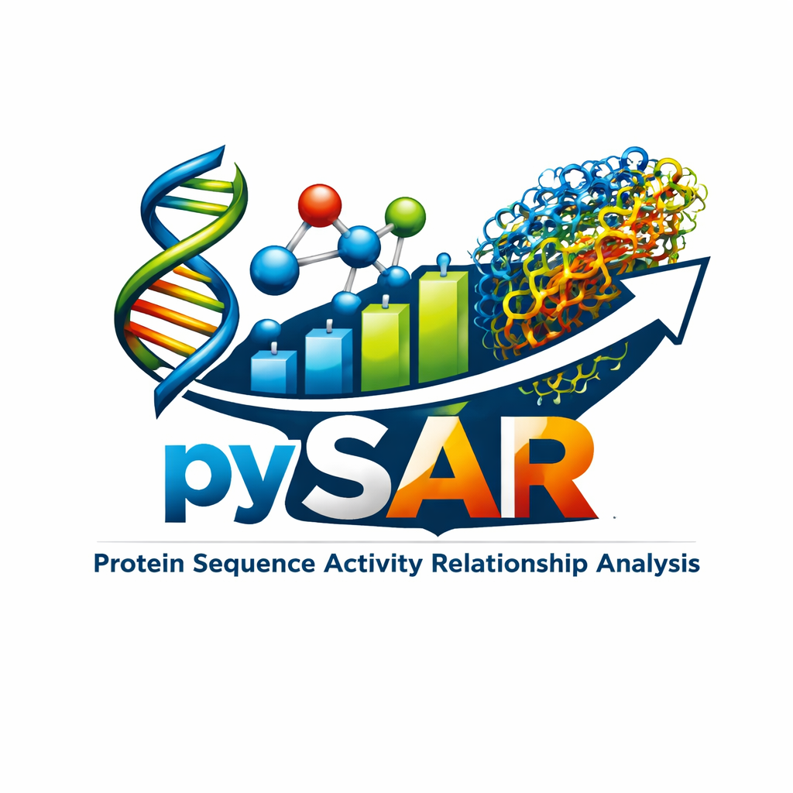

Welcome to pySAR's documentation!
==================================

Introduction
------------

**pySAR** is a Python library for analysing **Sequence Activity Relationships (SARs)** and
**Sequence Function Relationships (SFRs)** of protein sequences. pySAR offers extensive
functionalities that allow you to numerically encode a dataset of protein sequences and their
constituent amino acids using a large abundance of available methodologies and features,
supporting **400,000+ different encoding strategies**.

The software uses physicochemical and biochemical features from the
`Amino Acid Index (AAI) database <https://www.genome.jp/aaindex/>`_ via the custom-built
`aaindex <https://github.com/amckenna41/aaindex/>`_ package, as well as allowing for the
calculation of a range of structural, physicochemical and biochemical protein descriptors via
the custom-built `protpy <https://github.com/amckenna41/protpy/>`_ package.

The numerical encoding of protein sequences is a necessary precursor to building a **predictive
regression Machine Learning (ML) model**, with the training data being the encoded sequences and
the training labels being the in vitro experimentally pre-calculated activity values for each
sequence. This model maps protein sequences to the sought-after activity value, enabling accurate
prediction of the activity or fitness of new, unseen sequences.

.. note::

   Source code is available at
   `https://github.com/amckenna41/pySAR <https://github.com/amckenna41/pySAR/>`_.

   The accompanying research article is published in the *Journal of Biomedical Informatics:
   Machine learning based predictive model for the analysis of sequence activity relationships using protein spectra and protein descriptors*
   `doi:10.1016/j.jbi.2022.104016 <https://doi.org/10.1016/j.jbi.2022.104016>`_.

Background
----------

Accurately establishing the connection between a protein sequence and its function remains a
focal point within the fields of proteomics, protein engineering and drug discovery. There has
been a continued drive to build accurate and reliable predictive models via ML that allow for
the virtual screening of many protein mutant sequences — measuring the relationship between
sequence and fitness or activity, commonly known as a Sequence-Activity-Relationship (SAR) or
Sequence-Function-Relationship (SFR).

Due to the cost and impracticality of experimentally measuring activity and fitness values for
large libraries of mutant sequences, it is of great benefit to accelerate and automate this
process computationally. The use-case for **pySAR** is where a user has a set of in vitro
experimentally determined activity values for a library of mutant protein sequences and wants to
computationally predict the sought activity value for unseen sequences — with the aim of finding
the sequence that best minimises or maximises the target activity.

An important preliminary stage in building these predictive models is the numerical encoding of
protein sequences, as sequences and their constituent amino acids cannot be directly passed into
ML models. **pySAR** primarily focuses on encoding strategies involving the AAIndex database and a
variety of sequence-derived physicochemical and biochemical descriptors. Across all combinations
of features and descriptors, **pySAR** supports **400,000+ different encoding strategies**.

Directed Evolution (DE) is a prominent real-world application: a methodology for protein engineering 
that mimics natural selection, optimising a protein through iterative rounds of mutagenesis, selection and
amplification. **pySAR** can accelerate such workflows by computationally predicting which mutant
sequences are most likely to yield the desired activity value, reducing the burden of wet-lab
experimentation.

Features
--------

* **AAI Encoding** — encode sequences using physicochemical indices from the AAIndex database
  combined with Digital Signal Processing (DSP) spectral features.
* **Descriptor Encoding** — encode sequences using 33 protein physicochemical, biochemical and
  structural descriptors.
* **AAI + Descriptor Encoding** — combine both encoding strategies for richer feature matrices.
* **Pre-calculated descriptor support** — import pre-computed descriptor CSV files to skip
  recomputation and speed up the pipeline.
* **Predictive ML model building** — train regression models (e.g. PLS, Random Forest, SVR)
  directly from encoded sequences and activity labels.
* **Model evaluation** — assess model performance using R², RMSE and other regression metrics.
* **Visualisation** — generate plots of encoding results, model performance and descriptor
  distributions via matplotlib and seaborn.
* **Config-driven** — all parameters are managed via JSON configuration files.

Contents
========
.. toctree::
   :maxdepth: 2

   usage
   descriptors
   models
   dsp
   contributing